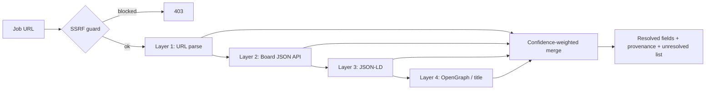

# Switchboard

**A mobile-first job-switch tracker: paste a job link, get a tracked application.**

[](https://switchboard-cyan.vercel.app)
[](https://github.com/hrxth-xk/switchboard/actions/workflows/ci.yml)


Preparing for a job switch means running four things at once — DSA revision, applications,
resume versions, and side projects. Most people end up with a spreadsheet that goes stale in
a week. Switchboard collapses all four into one app, and removes the most tedious part:
paste a posting URL and the application fills itself in.

---

## What it does

| | |
|---|---|
| **Applications** | Paste any job URL — Switchboard extracts company, role, requisition ID, and location, then tracks the application through wishlist → applied → interviewing → outcome. |
| **Resume library** | Versioned resumes stored in Supabase Storage, with one-off variants tailored to a single application. Every application records which version was sent. |
| **DSA tracking** | Problems tracked by topic, pattern, difficulty, and confidence, with revisits scheduled on a spaced-repetition curve. Bulk import from a LeetCode profile. |
| **Goals & pace** | Daily targets for problems, applications, and project sessions, with weekly consistency and monthly trend views — computed in the user's own timezone. |
| **Projects & activity** | Side projects with next-step tracking, and a unified activity feed across everything above. |

---

## Architecture

### The job import pipeline

The interesting problem here is that job boards have no shared standard, actively resist
scraping, and redirect aggressively. The naive approach — fetch the page, read the title —
fails on most of them, and fails *silently*.

Switchboard treats extraction as **evidence gathering rather than parsing**. Four layers each
contribute *candidates* per field, and the highest-confidence candidate wins:



| Layer | Latency | Blockable | Trusted for |
|---|---|---|---|
| URL parse | none | no | company, requisition ID |
| Board API | low | rate limits | requisition ID, role, location |
| JSON-LD | page fetch | yes | company, role, description |
| OpenGraph | page fetch | yes | weak fallback only |

Three decisions carry most of the weight:

**A partial result is still a result.** The endpoint returns whatever resolved plus an
`unresolved` list, and the UI pre-fills what it has instead of showing an empty form.
Only a malformed or unreachable URL is an error.

**Provenance is tracked per field.** Every resolved value carries the source and confidence
that produced it, so a low-trust guess is never indistinguishable from an API-confirmed fact.

**Cross-host redirects lose trust.** When a fetch lands on a different host than requested,
page-derived sources are down-weighted — that's what stops a careers landing page being
read as a job posting.

Board-specific quirks are isolated behind a common importer interface
(`lib/job-import/importers/`), so adding a board is one file. The whole pipeline runs under a
9-second budget with per-layer timeouts.

### SSRF protection

The import endpoint makes the server fetch a URL the user typed, so `lib/job-import/net/guard.ts`
sits in front of every request and every redirect hop:

- Protocol, port (80/443 only), and embedded-credential checks
- IPv4 private/reserved CIDR blocklist, including link-local `169.254.0.0/16` (cloud metadata)
- IPv6 unwrapping for `::ffff:`-mapped, NAT64, and 6to4 forms
- Single-label hostname rejection (`http://wiki/`) and blocked internal suffixes
- DNS resolution with rejection if *any* returned address is private
- Redirects walked manually so each hop is re-checked, capped at 4 hops
- Byte-capped streaming reads that abort mid-stream

Known residual risk is documented in the module: classic DNS rebinding is not fully closed,
because Node's `fetch` resolves independently of the pre-check. Closing it needs a custom
undici agent with a connect hook.

### Other design notes

- **Sessions** — JWT in an httpOnly cookie, checked against `passwordChangedAt` on every read
  so a password change revokes outstanding sessions. Revocation fails open by design: the
  signature is still valid, and a database blip shouldn't sign everyone out.
- **Password reset** — 32 random bytes, SHA-256 hashed at rest, one live token per user,
  consumed atomically so a token can't be used twice.
- **Durable undo** — `ProblemRevisit` records the previous values a revisit overwrote, so undo
  works long after the toast is gone rather than living in client state.
- **Timezone-correct days** — the browser's IANA zone is carried in a cookie and validated
  server-side, then used to derive calendar-day keys. The day key and zone are both part of
  the dashboard cache key, so a user at 1am IST doesn't see yesterday's numbers.
- **Caching** — `unstable_cache` with per-user tags; mutations revalidate only that user's
  dashboard.

---

## Tech stack

**Framework** Next.js 14 (App Router, Server Components) · React 18 · TypeScript 5.7
**Data** PostgreSQL · Prisma 6 · Supabase Storage
**Auth** `jose` JWT sessions · bcrypt · Resend for transactional mail
**UI** Tailwind-free custom CSS · Framer Motion · Lucide · Sonner
**Validation** Zod
**Testing** `node:test` via `tsx`

---

## Getting started

Requires Node 20+ and a PostgreSQL database. A local Postgres is included via Docker.

```bash
git clone https://github.com/hrxth-xk/switchboard.git
cd switchboard
npm install

cp .env.example .env      # fill in DATABASE_URL and SESSION_SECRET at minimum
docker compose up -d      # optional: local Postgres on :5432

npm run db:push
npm run db:seed
npm run dev
```
Hrithik

Resume upload requires `SUPABASE_URL` and `SUPABASE_SERVICE_ROLE_KEY`. Without a
`RESEND_API_KEY`, password reset links are printed to the server console instead of emailed.

```bash
npm test          # job-import unit tests
npm run build     # production build
```

---

## Project structure

```
app/
  api/            route handlers — auth, applications, problems, resumes, imports
  dashboard/      authenticated app shell and pages
components/       feature-grouped UI (applications, dsa, resumes, dashboard, landing)
lib/
  job-import/     URL parsing, board importers, SSRF guard, provenance merge
  leetcode/       GraphQL client, profile importer, pattern mapping
  capture/        generic analyze → extract → normalize → validate pipeline
  auth*.ts        sessions, one-time tokens, password hashing
prisma/           schema and migrations
```

Tests live beside the code they cover, in `lib/job-import/__tests__/`.

---

## Known limitations

Being explicit about these, since they're deliberate scope calls rather than oversights:

- **Rate limiting is in-process.** On serverless it's per-instance and resets on cold start —
  a deterrent against casual abuse, not a control. Needs Redis or Vercel KV to be real.
- **No CSRF tokens.** Currently relying on `sameSite: "lax"` cookies.
- **The LeetCode importer falls back to a public third-party mirror** when leetcode.com's
  GraphQL is Cloudflare-blocked, which is an availability dependency outside my control.
- **`lib/capture/` is not yet wired into the live flows.** It's a seam built ahead of a
  planned browser extension.
- **Test coverage is concentrated** on the pure job-import layers. UI and route handlers are
  untested.

---

## Roadmap

- Browser extension for one-click capture from any careers page
- Interview round scheduling and outcome tracking
- Redis-backed rate limiting
- Resume diffing across versions

---

## License

All rights reserved — see [LICENSE](LICENSE). Source is visible for review; no reuse is permitted.
